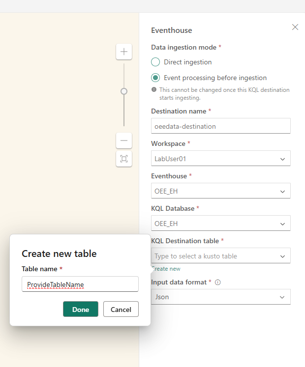

## Table of Contents

- [Introduction](#introduction)
- [Modalities](#modalities)
- [Authors](#authors)
- [Fabric Real Time Intelligence](#fabric-real-time-intelligence)
  - [Eventstreams](#Eventstreams)
  - [Shortcuts](#shortcuts)
  - [Eventhouse](#Eventhouse)
  - [KQL Update policies](#kql-update-policies)
  - [KQL Materialized Views](#kql-materialized-views)
  - [One Logical Copy](#one-logical-copy)
  - [KQL Dynamic fields](#kql-dynamic-fields)
  - [Kusto Query Language (KQL)](#kusto-query-language-kql)
  - [Real-Time Dashboards](#real-time-dashboards)
  - [Data Activator](#data-activator)
  - [Copilot](#copilot)
- [Architecture](#architecture)
  - [Components of Fabric's Real-Time Intelligence](#components-of-fabrics-real-time-intelligence)
- [Pre-requisites](#pre-requisites)
  - [Fabric tenant and capacity for Instructor led trainings](#fabric-tenant-and-capacity-for-instructor-led-trainings)
  - [Trial Tenant for the Lab](#trial-tenant-for-the-lab)
- [Building the platform](#building-the-platform)
  - [1. Login to Lab Environment](#1-login-to-lab-environment)
  - [2. Fabric Workspace](#2-fabric-workspace)
  - [3. Create a new Eventhouse](#3-create-a-new-Eventhouse)
  - [4. Enable OneLake Availability](#4-enable-onelake-availability)
  - [5. Create a new Eventstream](#5-create-a-new-Eventstream)
  - [6. Define Eventstream topology](#6-define-Eventstream-topology)
  - [7. Setting up the Lakehouse](#7-setting-up-the-Lakehouse)
  - [8. Build the KQL DB schema](#8-build-the-kql-db-schema)
  - [9. Real-Time Dashboard](#9-real-time-dashboard)
  - [10. Data Activator](#10-data-activator)
  - [11. Bonus Challenges](#11-bonus-challenges)
  - [12. Stop the notebook](#12-stop-the-notebook)
- [Continue your learning](#continue-your-learning)


---


# Introduction

Suppose you work for a manufacturing organization.  You've been tasked with developing a solution that will monitor machines in the warehouse.  This solution will be leveraged by consumers to understand issues, performance, and health of the overall operations.

This workshop will walk you through the process of building an end-to-end [Real-Time Intelligence](https://blog.fabric.microsoft.com/en-us/blog/introducing-real-time-intelligence-in-microsoft-fabric) Solution in MS Fabric, using the medallion architecture, for your leadership team.

You will learn how to:

- Build an operational analytics solution using Fabric Real-Time Intelligence based on data being sent from various IOT devices.
- Use Fabric shortcuts to query data without move or copy.
- Stream events into Fabric Eventhouse via Eventstream.
- Create real-time data transformations in Fabric Eventhouse through the power of Kusto Query Language (KQL).
- Leverage OneLake availability to access data via Lakehouse.
- Create real-time visualizations using Real-Time Dashboards.
- Build Data Activator Reflex actions and alerts on the streaming data.

See what real customers like [McLaren](https://www.linkedin.com/posts/shahdevang_if-you-missed-flavien-daussys-story-at-build-activity-7199013652681633792-3hdp), [Dener Motorsports](https://customers.microsoft.com/en-us/story/1751743814947802722-dener-motorsport-producose-ltd-azure-service-fabric-other-en-brazil), [Elcome](https://customers.microsoft.com/en-us/story/1770346240728000716-elcome-microsoft-copilot-consumer-goods-en-united-arab-emirates), [Seair Exim Solutions](https://customers.microsoft.com/en-us/story/1751967961979695913-seair-power-bi-professional-services-en-india) & [One NZ](https://customers.microsoft.com/en-us/story/1736247733970863057-onenz-powerbi-telecommunications-en-new-zealand) are saying.

All the **code** in this tutorial can be found here:  
[Centic Consulting - Data Engineer in a Day Repo](https://github.com/centricconsulting/Fabric-in-a-day/)

[Back to Table of Contents](#table-of-contents)
## Modalities

- Total workshop duration is 5-6 hours.
- Each section is accompanied with technical explanation of the Fabric Real-Time Intelligence component being used in the tutorial.
- Without the accompanied explanation, the tutorial can be completed in 1-2 hours.

[Back to Table of Contents](#table-of-contents)
## Authors

- [Josh Higginbotham](https://www.linkedin.com/in/joshua-higginbotham-55625798/), Senior Architect
- [Sipi Krishna](https://www.linkedin.com/in/sipi-k-902570187/), Senior Architect
- [Jeff Aalto](https://www.linkedin.com/in/jeff-aalto-895a423/), Principal Architect
- [Thomas Romans](https://www.linkedin.com/in/thomasromanmiami), Senior Architect
- [Todd Lyman](https://www.linkedin.com/in/toddlyman/), Senior Architect

[Back to Table of Contents](#table-of-contents)

---

## Fabric Real Time Intelligence

Let's cover the key features of Real-Time Intelligence and how we plan to use them for our architecture.

### Eventstreams

- Eventstreams allow us to bring real-time events (including Kafka endpoints) into Fabric, transform them, and then route them to various destinations without writing any code (no-code).


- Enhanced capabilities allow us to source data into Eventstreams from Azure Event Hubs, IoT Hubs, Azure SQL Database (CDC), PostgreSQL Database (CDC), MySQL Database (CDC), Azure Cosmos Database (CDC), Google Cloud Pub/Sub, Amazon Kinesis Data Streams, Confluent Cloud Kafka, Azure Blog Storage events, Fabric Workspace Item events, Sample data or Custom endpoint (Custom App).

- Feature [documentation](https://learn.microsoft.com/fabric/real-time-analytics/event-streams/overview).
  
[Back to Table of Contents](#table-of-contents)
### Shortcuts

- Shortcuts enable the creation of a live connection between OneLake and data sources, whether internal or external to Azure. This allows us to retrieve data from these locations as if they were seamlessly integrated into Microsoft Fabric.

- A shortcut is a schema entity that references data stored external to a KQL database in your cluster. In Lakehouse(s), Eventhouse(s), or KQL Databases it's possible to create shortcuts referencing internal locations within Microsoft Fabric, ADLS Gen2, Spark Notebooks, AWS S3 storage accounts, or Microsoft Dataverse.

- By enabling us to reference different storage locations, OneLake's Shortcuts provides a unified source of truth for all our data, within the Microsoft Fabric environment and ensures clarity regarding the origin of our data.

- Feature [documentation](https://learn.microsoft.com/fabric/real-time-analytics/onelake-shortcuts?tabs=onelake-shortcut).
  
[Back to Table of Contents](#table-of-contents)
### Eventhouse

- An Eventhouse can host multiple KQL Databases for easier management. It will store events data from the Eventstream, leverage shortcuts and automate transformations in real-time. Eventhouses are **specifically tailored** to time-based, streaming or batch events with structured, semi-structured, and unstructured data.

- An Eventhouse is the best place to store streaming data in Fabric. It provides a highly scalable analytics system with built-in Machine Learning capabilities for discrete analytics over highly-granular data. It's useful for any scenario that includes event-based data, for example, telemetry and log data, time series and IoT data, security and compliance logs, or financial records.

- Eventhouses support Kusto Query Language (KQL) queries, T-SQL queries and Python. The data is automatically made available in delta-parquet format and can be easily accessed from Notebooks for more advanced transformations.

- Feature [documentation](https://learn.microsoft.com/fabric/real-time-intelligence/Eventhouse).
  
[Back to Table of Contents](#table-of-contents)
### KQL Update policies

- This feature is also known as a mini-ETL. Update policies are automation mechanisms, triggered when new data is written to a table. They eliminate the need for external orchestration by automatically running a query to transform the ingested data and save the result to a destination table.

- Multiple update policies can be defined on a single table, allowing for different transformations and saving data to multiple tables simultaneously. **Target** tables can have a different schema, retention policy, and other policies than the **Source** table.

- In this solution, the data in derived silver layer tables (targets) of our medallion architecture is inserted upon ingestion into bronze tables (sources). Using Kusto's update policy feature, this appends transformed rows in real-time into the target table, as data is landing in a source table. This can also be set to run as a transaction, meaning if the data from bronze fails to be transformed to silver, it will not be loaded to bronze either. By default, this is set to off allowing maximum throughput.

- Feature [documentation](https://learn.microsoft.com/azure/data-explorer/kusto/management/update-policy).
  
[Back to Table of Contents](#table-of-contents)
### KQL Materialized Views

- Materialized views expose an aggregation query over a source table, or over another materialized view. We will use materialized views to create the Gold Layer in our medallion architecture. Most common materialized views provide the current reading of a metric or statistics of metrics over time. They can also be backfilled with historical data; however, by default they are automatically populated by newly ingested data.

- Feature [documentation](https://learn.microsoft.com/azure/data-explorer/kusto/management/materialized-views/materialized-view-overview).
  
[Back to Table of Contents](#table-of-contents)
### One Logical Copy

- This feature creates a one logical copy of KQL Database data by turning on OneLake availability. Turning on OneLake availability for your KQL tables, database or Eventhouse means that you can query the data in your KQL database in Delta Lake format via other Fabric engines such as Direct Lake mode in Power BI, Warehouse, Lakehouse, Notebooks, and more. When activated, it will copy via mirroring the KQL data to your Fabric Datalake in delta-parquet format. Allowing you to shortcut tables from your KQL Database via OneLake to your Fabric Lakehouse, Data Warehouse, and also query the data in delta-parquet format using Spark Notebooks or the SQL-endpoint of the Lakehouse.

- Feature [documentation](https://learn.microsoft.com/fabric/real-time-analytics/one-logical-copy).
  
[Back to Table of Contents](#table-of-contents)
### KQL Dynamic fields

- Dynamic fields are a powerful feature of KQL databases that support evolving schema changes and object polymorphism, allowing the storage/querying of different event types that have a common denominator of base fields.

- Feature [documentation](https://learn.microsoft.com/azure/data-explorer/kusto/query/scalar-data-types/dynamic).
  
[Back to Table of Contents](#table-of-contents)
### Kusto Query Language (KQL)

- KQL is also known as the language of the cloud. It's available in many other services such as Microsoft Sentinel, Azure Monitor, Azure Resource Graph and Microsoft Defender. The code-name **Kusto** engine was invented by 4 engineers from the Power BI team over 10 years ago and has been implemented across all Microsoft services including Github Copilot, LinkedIn, Azure, Office 365, and XBOX.

- KQL queries are easy to write, read and edit. The language is most commonly used to analyze logs, sign-on events, application traces, diagnostics, signals, metrics and much more. Supports multi-statement queries, relational operators such as filters (where clauses), union, joins aggregations to produce a tabular output. It allows the ability to simply pipe (|) additional commands for ad-hoc analytics without needing to re-write entire queries. It has similarities to PowerShell, Excel functions, LINQ, SQL functions, and OS Shell (Bash). It supports DML statements, DDL statements (referred to as Control Commands), built-in machine learning operators for forecasting & anomaly detection, plus more... including in-line Python & R-Lang.

- In this solution, KQL commands will be automatically created and executed by Eventstream to ingest data when configuring the Eventhouse KQL Database destination in the Eventstream. These commands will create the respective 'bronze' tables. Secondly, the control commands will be issued in a database script that automate creation of additional schema items such as Tables, Shortcuts, Functions, Policies and Materialized-Views.
- Feature [documentation](https://learn.microsoft.com/azure/data-explorer/kusto/query/).
  
[Back to Table of Contents](#table-of-contents)
### Real-Time Dashboards


- While similar to Power BI's dashboard functionality, Real-Time Dashboards have a different use case. Real-Time Dashboards are commonly used for operational decision making, rather than the business intelligence use cases Power BI targets. Power BI supports more advanced visualizations and provides a rich data-story capabilities. Real-Time Dashboards refresh very fast and allow with ease to toggle between visuals, and analysts to pro-developer can explore/edit queries without needing to download a desktop tool. This makes the experience simpler for analysts to understand and visualize large volumes of highly-granular data.

- Real-Time Dashboards also support sharing while retaining permission controls, setting of alerts via Data Activator, and automatic refresh with a minimum frequency of 30 seconds.

- Feature [documentation](https://learn.microsoft.com/fabric/real-time-intelligence/dashboard-real-time-create).

[Back to Table of Contents](#table-of-contents)
### Data Activator

- Data Activator (code-name Reflex) is a no-code experience in Microsoft Fabric for automatically taking actions when patterns or conditions are detected in changing data. It monitors data in Power BI reports, Eventstreams items and Real-Time Dashboards, for when the data hits certain thresholds or matches other patterns. It then triggers the appropriate action, such as alerting users or kicking off Power Automate workflows.

- Some common use cases are:

  - Run Ads when same store sales decline.
  - Alert store managers to move food from failing freezers before it spoils.
  - Retain customers who had a bad experience by tracking their journey through apps, websites etc.
  - Help logistics companies find lost shipments proactively by starting an investigation when package status isn't updated for a certain length of time.
  - Alert account teams when customers fall behind with conditional thresholds.
  - Track data pipeline quality, to either re-run jobs, alert for detected failures or anomalies.

- In this solution, we will set an alert in our Real-Time Dashboard to **Message me in Teams** functionality.

- Feature [documentation](https://learn.microsoft.com/fabric/data-activator/data-activator-introduction).

[Back to Table of Contents](#table-of-contents)
### Copilot

- Copilot for Real-Time Intelligence is an advanced AI tool designed to help you explore your data and extract valuable insights. You can input questions about your data, which are then automatically translated into Kusto Query Language (KQL) queries. Copilot streamlines the process of analyzing data for both experienced KQL users and citizen data scientists.

- Feature [documentation](https://learn.microsoft.com/fabric/get-started/copilot-real-time-intelligence).


[Back to Table of Contents](#table-of-contents)

---


## Architecture

### Components of Fabric's Real-Time Intelligence


Real-Time Intelligence allows organizations to ingest, process, analyze and, questions over your data using natural language, transform and automatically act on data. All with a central hub (Real-Time Hub) to easily access and visualize all internal and external, first- and third-party streaming data.

Using Real-Time Intelligence enables faster, more accurate decision-making and accelerated time to insight.

[Back to Table of Contents](#table-of-contents)

---

## Pre-requisites

- Recommended material to review (at least one) prior to this lab, however it's not required:
  - [Write your first query with Kusto](https://aka.ms/learn.kql)
  - [Implement a Real-Time Intelligence Solution Tutorial](https://learn.microsoft.com/fabric/real-time-intelligence/tutorial-introduction)
  - To complete the lab you **must** have access to a [Microsoft Fabric](https://www.microsoft.com/microsoft-fabric/getting-started) workspace with at least Contributor permissions.

[Back to Table of Contents](#table-of-contents)
### Fabric tenant and capacity for Instructor led trainings

<div class="important" data-title="Note">

> For the purpose of this tutorial, speakers/proctors will provide a tenant with capacity for you to build your solution.

</div>

[Back to Table of Contents](#table-of-contents)
### Trial Tenant for the Lab

If you need a new Trial Tenant to complete the lab, suggest to register a new Outlook.com email and follow these steps:

1. [Provision Fabric Trial Tenant](https://github.com/microsoft/FabricRTIWorkshop/tree/main/trialtenant) - see document and powershell script to setup a lab admin.
   - 25 workspaces with access to 25 logins will be created automatically (one workspace per user).
   - Participants should create items in the workspace designated to their own login.
   - If more than 25 accounts are necessary, additional Trial Tenants can be provisioned by repeating this process again. Also, participants can share the lab credentials and use folders in their workspaces.
2. [Office 365 E5 Trial](https://blog.fabric.microsoft.com/blog/accessing-microsoft-fabric-for-developers-startups-and-enterprises). ⚠️ Make sure to disable recurring billing, otherwise your credit card will be charged for Office E5.
3. The "LabAdmin" credential should be used by the lab proctor.
4. The "LabAdmin" can have the pre-built lab items for Lab Users 01-24 to reference as a cheat-sheet. To do so, grant Users 01-24 viewer permission to the "LabAdmin" workspace.
   

---

[Back to Table of Contents](#table-of-contents)

## Building the platform

### 1. Login to Lab Environment

<div class="info" data-title="Note">
  
> Do **not** use an InPrivate browser window. Recommend using a Personal browser window to successfully run this lab.
</div>

1. Open [app.fabric.microsoft.com](https://app.fabric.microsoft.com/) in your browser.

   

2. Login with provided credentials, if a trial fabric tenant was previously setup (reference [Pre-reqs](#pre-requisites)). You may also choose to run the lab in your own Fabric Tenant if you already have one.
   
3. Setting Up Multi-Factor Authentication (MFA) on First Login

When you log in for the first time, you will be required to set up Multi-Factor Authentication (MFA) using the Microsoft Authenticator app. This enhances the security of your account.

#### Steps to Set Up MFA:

1. **Download the Microsoft Authenticator App**
   - Go to the App Store (iOS) or Google Play Store (Android) on your mobile device.
   - Search for "Microsoft Authenticator" and install the app.

2. **Sign In to the Portal**
   - Open [Microsoft Fabric](https://app.fabric.microsoft.com/) in your browser.
   - Enter your provided credentials and click **Sign in**.

3. **Begin MFA Setup**
   - After entering your credentials, you will be prompted to set up additional security.
   - Choose **Microsoft Authenticator** as your authentication method.

4. **Scan the QR Code**
   - On your computer screen, a QR code will be displayed.
   - Open the Microsoft Authenticator app on your phone.
   - Tap **Add account** > **Work or school account** > **Scan a QR code**.
   - Use your phone to scan the barcode shown on your computer.

5. **Complete Setup**
   - Follow the instructions in the app to finish the setup process.
   - Once complete, you may be prompted to approve a test sign-in notification on your phone.

6. **You're All Set!**
   - Each time you log in, you may be asked to approve future sign-ins via the app.

> **Tip:** If you encounter issues, refer to the [Microsoft Authenticator setup guide](https://support.microsoft.com/en-us/account-billing/how-to-use-the-microsoft-authenticator-app-9783c865-0308-42fb-a519-8cf9e91a3a32).

7. Click **Real-Time Intelligence**.

   


[Back to Table of Contents](#table-of-contents)

### 2. Fabric Workspace

1. Click **Workspaces** on the left menu and open the Fabric Workspace **designated** to your login by the Fabric Trial Tenant. e.g. If you are User07, your lab workspace name will be LabUser07.


[Back to Table of Contents](#table-of-contents)

### 3. Create a new Eventhouse

1. To create an Eventhouse click on the button **+ New Item**.

   

2. In the popup window **New item** select **Eventhouse**

   

3. In the dialog **New Eventhouse** insert `OEE_EH` as name and click on **Create**

   

   After the Eventhouse has been created it will be automatically opened.

<div class="info" data-title="Note">
  
> The [Eventhouse](https://learn.microsoft.com/en-us/fabric/real-time-intelligence/Eventhouse) is designed to handle real-time data streams efficiently, which lets organizations ingest, process, and analyze data in near real-time. Eventhouses are particularly useful for scenarios where **timely insights are crucial**. Eventhouses are **specifically tailored** to time-based, streaming events with multiple data formats. This data is automatically indexed and partitioned based on ingestion time.
</div>

[Back to Table of Contents](#table-of-contents)

### 4. Enable OneLake Availability

This feature is also called **"one logical copy"** and it automatically allows KQL Database tables to be accessed from a Lakehouse, Notebooks, etc in delta-parquet format via OneLake.

When activated it will constantly copy the KQL data to your Fabric OneLake in delta format. It allows you to query KQL Database tables as delta tables using Spark or SQL endpoint on the Lakehouse. We recommend enabling this feature "before" we load the more data into our KQL Database. Also, consider this feature can be enabled/disabled per table if necessary. You can read more about this feature here: [Announcing Delta Lake support in Real-Time Intelligence KQL Database](https://support.fabric.microsoft.com/blog/announcing-delta-support-in-real-time-analytics-kql-db?ft=All).


[Back to Table of Contents](#table-of-contents)

#### Here's how to set this up

1. When an Eventhouse is created, a KQL Database with the same name is created as well. To open the KQL Database click on the Database **OEE_EH** in the section **KQL Databases**.

   

2. After selecting the KQL Database click on the switch **availability** to activate the OneLake availability as shown in the screenshot.

   

   <div class="info" data-title="Note">

   > **Newly created tables will automatically inherit the "OneLake availability" setting from the Database level**

   </div>

3. Now the dialog **Turn on OneLake availability** is shown. Ensure that **Apply to existing tables** is checked and click on the button **Turn on**.

   

[Back to Table of Contents](#table-of-contents)

### 5. Create a new Eventstream

In this section we will be streaming events from an Eventhub deployed to Azure. The events will be streamed into an Eventstream and consumed by our Eventhouse KQL Database.


1. Select your Workspace in the left pane. In our example it is **Fabric_Manufacturing_Demo**. If you have been assigned a Workspace at the start of this lab, choose the workspace name that was provided to you. Then click on **+ New Item**. In the popout window scroll a little bit down and select **Eventstream**.

   

2. Give the Eventstream the name `oeedata_es`.  
Then select **Create**.

   


3. On the Screen **Design a flow to ingest, transform, and route streaming events** click on **Connect Data Source**. This will allow us to our eventhub deployed to Azure which Litmos is routing data to.

   

4. On this screen will select `Azure Event Hubs` as the source type to select click on **Connect**.

   

5. We will then **not** need to create a new connection to our event hub in Azure.  Select an **Existing Connection** from the dropdown. We will create 5 Eventstreams for this training.
   The first Eventstream is oeedata_es - Select the connection **litmus-oeedata** for this Eventstream

   

7. We then need to provide consumer group details for the selected EventHub. Each user is assigned their own consumer group. Enter the provided consumer group in the Consumer group text area. Then Click on Next and Add. 

   

   Now the Eventstream will be published.

8. After connecting, you should go to the Eventstream editor.  Here we will want to do an initial publish to activate the stream.  This will allow us to work with the data as it's streamed in.  To publish hit the **Publish** button in the top right of the screen. 

   


[Back to Table of Contents](#table-of-contents)

### 6. Define Eventstream topology

Next we have to create the Eventstream topology that will insert the streamed data into our KQL Database. To achieve this please follow the following steps.


2. Click on **Edit** in the top toolbar.

   

3. Click on the node **Transform events or add Destination** and select **Eventhouse** under Destinations from the menu.

   

   <div class="info" data-title="Note">

   > Pay attention to the table you can see at the bottom of the screen. Here you can see events that are streamed by notebook to the event already.

   </div>

4. This will then display a screen for entering in details of where we want to write our data to.

   
   

6. Provide the following values in the pane **Eventhouse** on the left side. For the KQL Destination Table, we will need to select Create new and then set the name.  Once filled out, we will then click on **Save**.

   | Field                           | Value               |
   | :------------------------------ | :------------------ |
   | **Event processing before ingestion** | Ensure that this option is selected.    
   | **Destination name**           | `oeedata-destination` |
   | **Workspace**                   | **Workspace Name assigned by Trainer**       |
   | **KQL Database**                | **OEE_EH**          |
   | **KQL Destination table**       | `bronze_oeedata`             |
   | **Input data format**                 | Ensure that the option **Json** is selected.   

   <div class="important" data-title="Note">

   > Note: Once filled out, your screen should look like the below.

   </div>

   

7. We will then publish the Eventsteam to activate the stream and start writing data to our Eventhouse.

   

8. We will then need to repeat the same steps 4 additional times. Create 4 more Eventstreams. Go back to the workspace. Click on New Item.  Details for 4 additional Eventstreams are below.
 * AnomalyHistory Event Stream Data

  | Field                           | Value               |
   | :------------------------------ | :------------------ |
   | **Eventstream Name**                  |AnomalyHistory_es|
   | **Connection**                        | Ensure that **litmus-anomaly-history** option is selected.    |
   | **Event processing before ingestion** | Ensure that this option is selected.  |  
   | **Destination name**           | `anomaly-history-destination` |
   | **Workspace**                   | **Workspace Name assigned by Trainer**       |
   | **KQL Database**                | **OEE_EH**          |
   | **KQL Destination table**       | `bronze_anomalyhistory`             |
   | **Input data format**                 | Ensure that the option **Json** is selected.  
     
 * Downtime Reason History Event Stream Data

  | Field                           | Value               |
   | :------------------------------ | :------------------ |
   | **Eventstream Name**                  |downtimereasonhistory_es|
   | **Connection**                        | Ensure that **litmus-downtime-reasons** option is selected.    |
   | **Event processing before ingestion** | Ensure that this option is selected.  |  
   | **Destination name**           | `downtime-reasons-destination` |
   | **Workspace**                   | **Workspace Name assigned by Trainer**       |
   | **KQL Database**                | **OEE_EH**          |
   | **KQL Destination table**       | `bronze_downtimereasonhistory`             |
   | **Input data format**                 | Ensure that the option **Json** is selected.  

  * Scrap History Event Stream Data

  | Field                           | Value               |
   | :------------------------------ | :------------------ |
   | **Eventstream Name**                  |scraphistory_es|
   | **Connection**                        | Ensure that **litmus-scrap-history** option is selected.    |
   | **Event processing before ingestion** | Ensure that this option is selected.  |  
   | **Destination name**           | `scrap-history-destination` |
   | **Workspace**                   | **Workspace Name assigned by Trainer**       |
   | **KQL Database**                | **OEE_EH**          |
   | **KQL Destination table**       | `bronze_scraphistory`             |
   | **Input data format**                 | Ensure that the option **Json** is selected.
  
* Work Order History Event Stream Data

  | Field                           | Value               |
   | :------------------------------ | :------------------ |
   | **Eventstream Name**                  |workorderhistory_es|
   | **Connection**                        | Ensure that **litmus-workorder-history** option is selected.    |
   | **Event processing before ingestion** | Ensure that this option is selected.  |  
   | **Destination name**           | `workorder-history-destination` |
   | **Workspace**                   | **Workspace Name assigned by Trainer**       |
   | **KQL Database**                | **OEE_EH**          |
   | **KQL Destination table**       | `bronze_workorderhistory`             |
   | **Input data format**                 | Ensure that the option **Json** is selected.
  

[Back to Table of Contents](#table-of-contents)

### 7. Setting up the Lakehouse

In this task we will set up the Lakehouse that will contain additional information for our usecase and in which we will also make the data from the KQL Database accessible through the Lakehouse.


1. To create a Lakehouse we first have to return to the workspace where all other objects are in. If you have been assigned a Workspace at the start of this lab, choose the workspace name that was provided to you.


2. Click on the button **+ New Item** in the toolbar and in the pop-up window click on the tile **Lakehouse**.

     

3. In the dialog **New Lakehouse** enter `OEE_LH` as name for the new Lakehouse. Ensure that the checkbox **Lakehouse Schemas (Public Preview)** is not checked. Then click on the button **Create**

   

4. We then create two notebooks that will be used to bring in reference data to enrich our streaming data.  To make this easier, we've uploaded these notebooks to the repo for you to import.  Go to the GitHub repo and download the notebooks **common_functions.ipynb** and **Load_reference_data.ipynb** under the notebook folder.

   

5. To upload the notebooks, go to your workspace and select **->| Import** / **Notebook** / **From this computer**.  Select the notebooks that we downloaded from GitHub.

   

6. Once the notebooks have been imported, we will attach the Lakehouse OEE_LH to the notebook.
    
   
8. Once the Lakehouse is attached, we then will open and run the **Load_reference_data** notebook.  This will download the csv data from our source (GitHub), create our delta table in our Lakehouse if it doesn't exist, then merging the data.  To run the notebook just select the **Run All** button on the notebook.

   

[Back to Table of Contents](#table-of-contents)

### 8. Build the KQL DB schema

In this section we will create all the silver tables, functions and enable update policies and in our Eventhouse KQL Database. One of the tables (`dim_assetitem`) are shortcuts to the Lakehouse and the data is **NOT** being copied into our KQL Database.


1. Open the KQL Database **OEE_EH** in the Eventhouse of your Fabric Workspace. To do so click on the Icon of the Eventhouse in the left toolbar.
   Then Click on the button **+ New** in the top toolbar and choose **OneLake shortcut** from the drop down menu.

   


3. Select **Microsoft OneLake**..

   

4. Select the Lakehouse **OEE_LH** and click on the button **Next**.

   

5. Expand the folder **Tables**, select the table **dim_assetitem** table and click on the button **Create**. This will create a shortcut to the table **dim_assetitem** in your Lakehouse without copying the data from the Lakehouse to Eventhouse.

   

   The next window is a current preview feature. The Accelerate feature. This feature caches the data from the shortcut and drastically increases the performance of the queries which reads this data.

   In this section, you can try to play with the feature (choose either to set in on or off), and see if you can spot the difference in the performance of the next steps.

   


6. Expand the folder **Shortcuts** in the tree of your Eventhouse **OEE_EH** to verify if the shortcut has been created correctly.

   

7. Click on the button **Query with code** at the top of the screen.

   

8. We will use the queryset to create our downstream tables and functions for the other layers of our medallion architecture

   

9. Download the following file and copy the contents into the KQL Queryset from before [Manufacturing_createAll.kql](https://github.com/centricconsulting/Fabric-in-a-day/blob/main/kql/Manufacturing_createAll.kql) Once pasted into the kql queryset, execute each step to see what is processed and then verify all objects are created successfully. 


10. Expand all folders in the database pane on the left. All tables and functions that have been created by the script can be found here.

    


[Back to Table of Contents](#table-of-contents)

### 9. Real-Time Dashboard

In this section, we will build a Real-Time Dashboard to visualize the streaming data and set it to refresh every 30 seconds. 


1. Change to the workspace. To do so click on the icon of your workspace on the left pane. In our example the workspace is named **LabUser01** Your workspace name will be different based on your user credentials. If you have been assigned a Workspace at the start of this lab, choose the workspace name that was provided to you.
2. To create a new realtime dashboard click on the button **+ New Item** and the select **Real-Time Dashboard**

   

3. Enter the name `OEE Dashboard` in the field **New Real-Time Dashboard**. Then click on **Create**.

   

An empty dashboard is being displayed. To add a visualisation click on the button **+ Add tile**.

   

4. Click on the Button **+ Data source**.

   

5. In the Window **One Lake Data Hub** select the Eventhouse **OEE_EH**. Then click on **Connect**.

   

6. As name keep the given name `OEE_EH`. Set the **Database** to **OEE_EH** and click on the button **Add**.

   

   
7. First step is to add a Base Query Click on Base queries on the Ribbon and enter the base query provided below.
   This base query can be used to simplify the logic required in your dashboard.
   Variable Name for base query **_master_query**
   
  To do this, select **Base queries**
  ```kusto
  silver_oeedata
  | join kind=leftouter external_table('dim_assetitem') 
  on $left.asset == $right.asset and $left.line == $right.line and $left.plant == $right.plant
  | extend A = availability, Q = quality, P = productivity, OEE = overallEquipmentEffectiveness
  | project itemcode, itemdescription, machinemodel, serialnumber, 
  OEE, plant, line, asset,  A, Q, P, timestamp, state, PartitionId, uptime,
  defectiveUnits, totalUnits, EventProcessedUtcTime, EventEnqueuedUtcTime
  ```
8. Save and Close the Base Query pop up. Next we will add two parameters in the RTI Dashboards. You will notice a default paramater is created for Time Range. We will not change the Time Range parameter. 
   1. First parameter name is Plant and VariableName is **plantParam**.
  KQL Query to select param value from silver table

  ```kusto
silver_oeedata
  | distinct plant
```

   Use the values provided in the screenshot below.

  

   3. Second parameter name is Machine - VariableName - **machineParam**.
   KQL Query to select param value from silver table

    ```kusto
    silver_oeedata
    | distinct asset
    ```

  Use the values provided in the screenshot below.

  

All parameters will look like below under Manage Tab - Manage Parameters. 


9. We will add the first visual. Click on New Tile. Proceed to paste each query below, add a visual, and apply changes. 

   <div class="important" data-title="Note">

> We will demo the steps for the very first Visual. From there on you can follow the exact same steps for all other visuals on your own.

   </div>


#### Total Units Produced

```kusto
//Total Units Produced
let latestTime = toscalar(['_master_query'] | summarize max(EventEnqueuedUtcTime));
let startTime = latestTime - 6h;
['_master_query']
| where timestamp >= startTime and timestamp <= latestTime  // Filter data from the last 7 days
| where isempty(['plantParam']) or plant in (['plantParam']) and isempty(['machineParam']) or asset in (['machineParam']) //and ItemCode == "Item123" and ItemDescription == "Sensor Module – Gen 2"
| summarize TotalUnitsProduced = max(totalUnits) by bin(timestamp,1d)
| project TotalUnitsProduced
```

1. Replace the content of the textbox by the code above. Click on the button **Run**. The query will be executed and the results will be shown in the table at the bottom. To create a visualisation click on the button **+ Add Visual**. This will open a pane at the right side of the browser.

2. Format the visual by entering `Total Units Produced` in the field **Title**. Select **Stat** in the combobox **Visual type**. Select Stat Chart. Then click on the button **Apply changes**.

   


7. Click on the tab **Home** and then click on **Save** Button. Now click on the button **New tile** again to proceed with the next visuals.

[Back to Table of Contents](#table-of-contents)

#### Average Defective Units

- Visual type: **Stat**.

```kusto
let latestTime = toscalar(['_master_query'] | summarize max(EventEnqueuedUtcTime));
let startTime = latestTime - 6h;
['_master_query']
| where isempty(['plantParam']) or plant in (['plantParam']) and isempty(['machineParam']) or asset in (['machineParam']) 
| where timestamp >= startTime and timestamp <= latestTime  // Filter data from the last 7 days
| summarize AverageDefectiveUnits = toint(avg(defectiveUnits)) 
| project AverageDefectiveUnits
```


#### Overall Equipment Effectiveness (OEE) – Last 6 Hours

- Visual type: **Area Chart**.

```kusto
let latestTime = toscalar(['_master_query'] | summarize max(EventEnqueuedUtcTime));
let startTime = latestTime - 6h;
['_master_query']
| where EventEnqueuedUtcTime between (startTime .. latestTime)
| where (isempty(['plantParam']) or plant in (['plantParam'])) and (isempty(['machineParam']) or asset in (['machineParam'])) 
| extend OEE = todouble(OEE)
| summarize avgOEE = avg(OEE) by bin(EventEnqueuedUtcTime, 1m)
| order by EventEnqueuedUtcTime asc
```


#### Availability – Last 6 Hours

- Visual type: **Line Chart**.

```kusto
let latestTime = toscalar(['_master_query'] | summarize max(EventEnqueuedUtcTime));
let startTime = latestTime - 6h;
['_master_query']
| where EventEnqueuedUtcTime between (startTime .. latestTime)
| extend ItemCode = itemcode, ItemDescription = itemdescription
| where (isempty(['plantParam']) or plant in (['plantParam'])) and (isempty(['machineParam']) or asset in (['machineParam'])) 
| extend Availability = todouble(A)
| summarize avgAvailability = avg(Availability) by bin(EventEnqueuedUtcTime, 5m)
| order by EventEnqueuedUtcTime asc
```


#### Productivity – Last 6 Hours
- Visual type: **Line Chart**.
  
Add a tile & paste the query below once. Note, this is a multi-statement query that uses multiple let statements & a query combined by semicolons.

   ```kusto
    let latestTime = toscalar(['_master_query'] | summarize max(EventEnqueuedUtcTime));
    let startTime = latestTime - 6h;
    ['_master_query']
    | where EventEnqueuedUtcTime between (startTime .. latestTime)
    // | where EventEnqueuedUtcTime > ago(6h)  // Uncomment this line to use real-time mode
    | extend ItemCode = itemcode, ItemDescription = itemdescription
    | where (isempty(['plantParam']) or plant in (['plantParam'])) and (isempty(['machineParam']) or asset in (['machineParam']))
    | extend Productivity = todouble(P)
    | summarize avgProductivity = avg(Productivity) by bin(EventEnqueuedUtcTime, 5m)
    | order by EventEnqueuedUtcTime asc
   ```


#### Quality – Last 6 Hours

- Visual type: **Line Chart**

  ```kusto
  let latestTime = toscalar(['_master_query'] | summarize max(EventEnqueuedUtcTime));
  let startTime = latestTime - 6h;
  ['_master_query']
  | where EventEnqueuedUtcTime between (startTime .. latestTime)
  | extend ItemCode = itemcode, ItemDescription = itemdescription
  | where (isempty(['plantParam']) or plant in (['plantParam'])) and (isempty(['machineParam']) or asset in (['machineParam'])) 
  | extend Quality = todouble(Q)
  | summarize avgQuality = avg(Quality) by bin(EventEnqueuedUtcTime, 5m)
  | order by EventEnqueuedUtcTime asc
  ```


#### Production Orders

- Visual type: **Table**

  ```kusto
  silver_workorderhistory
    | where (isempty(['plantParam']) or plant in (['plantParam'])) and (isempty(['machineParam']) or asset in (['machineParam']))
    | project woNumber, woDate, woType, assignedTo, plant, asset, line, taskDescription, priority, ingestionTime
  ```


Add conditional formatting for the table as shown in screenshots below. 


#### Rename Page 

Rename Page 1 to Production Click on the three dots to rename. 


#### OEE Dashboard Finale 

After you added all the visuals and moved them to their appropiate places your dashboard should look similar to this.


#### Auto-refresh

In this section we will enable auto-refresh so the dashboard will be automatically updated while it is shown on screen.

1. While editing the dashboard, click on the tab **Manage** and then click on the button **Auto refresh**. This will open a pane on the right side of the browser.


2. In the pane **Auto refresh** set it to **Enabled** and set **Default refresh rate** to **Continous**. Then click on the button **Apply**


3. Click on the tab **Home** and then click on the button **Save**.


[Back to Table of Contents](#table-of-contents)

### 10. Data Activator

In this section we will create a Reflex Alert that will send an Email Message when a value meets a certain threshold.

1. While editing the dashboard, select **Set alert** from the context menu. This will open the pane **Set alert** at the right side in the browser.


2. In the pane **Set alert** set the values as in the screenshot below

  

   Select **Email** as **Action**.


<div class="info" data-title="Note">
  
> The Reflex item will appear in your workspace and you can edit the Reflex trigger action. The same Reflex item can also trigger multiple actions. 
</div>


[Back to Table of Contents](#table-of-contents)

### 11. Bonus Challenges

#### Build Power BI report using the data in Eventhouse

Using the Gold Layer functions, build a Power BI report that shows statistics from the different campaign types

#### Build Fabric events streaming pipeline

Using the Fabric Events in Real-Time hub, build a pipeline that sends link to the documentation of Real-Time Dashboard when someone tried to create a new Real-Time Dashboard.

#### Alerting directly on Eventstream

Add Reflex as a destination to your Eventstream and create an email alert everytime number of impressions exceed a value of your choice 3 times every 10 minutes.

### 12. Stop the notebook

At this point you've completed the lab, so you may stop running the notebook.

1. Open the notebook **Generate synthetic events** from your workspace and click the button **Cancel all** in the toolbar at the top.

   


[Back to Table of Contents](#table-of-contents)


## THAT's ALL FOLKS !!


---

# Continue your learning

- [Implement a Real-Time Intelligence Solution with Microsoft Fabric](https://aka.ms/realtimeskill/)
- [Real-Time Intelligence documentation in Microsoft Fabric](https://aka.ms/fabric-docs-rta)
- [Microsoft Fabric Updates Blog](https://aka.ms/fabricblog)
- [Get started with Microsoft Fabric](https://aka.ms/fabric-learn)
- [The mechanics of Real-Time Intelligence in Microsoft Fabric](https://youtube.com/watch?v=4h6Wnc294gA)
- [Real-Time Intelligence in Microsoft Fabric](https://youtube.com/watch?v=ugb_w3BTZGE)

### Thank you!


